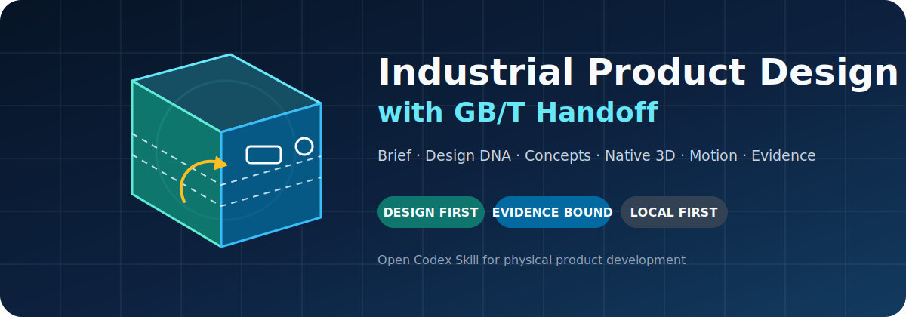
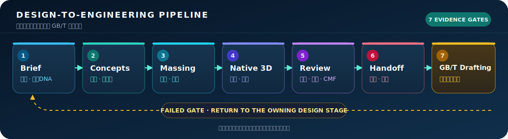
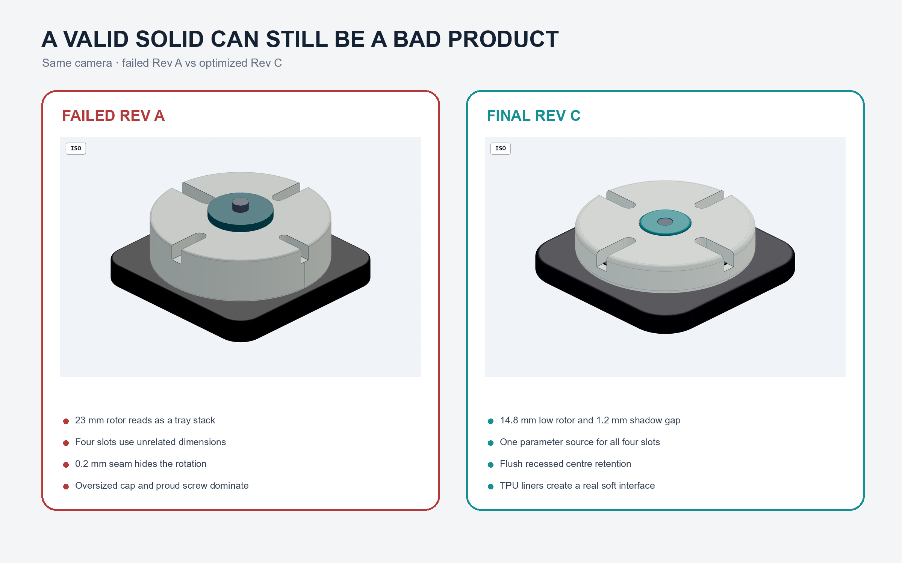

<p align="center">
  
</p>

<p align="center">
  <a href="https://github.com/beiming183-cloud/industrial-product-design-gbt/actions/workflows/validate.yml"></a>
  <a href="https://github.com/beiming183-cloud/industrial-product-design-gbt/releases"></a>
  <a href="LICENSE"></a>
  <a href="https://github.com/beiming183-cloud/industrial-product-design-gbt/stargazers"></a>
</p>

<p align="center"><strong>Design the product before documenting the geometry.</strong></p>

An open Codex Skill that connects industrial-design intent, concept selection, ergonomics, CMF, parametric 3D quality gates, motion review, and evidence-bound GB/T engineering handoff.

面向实体产品开发的工业设计 Skill：先解决用户场景、造型比例、人机、CMF、接口、运动状态和三维成品质量，再把已确认的设计修订交给国标机械制图流程。

> **Status: v0.1 early preview.** The workflow and deterministic gates are usable today. Native high-quality CAD execution still depends on the connected backend, and this project does not replace professional design, safety, compliance, or engineering approval.

## Why it exists

| Common failure | This project adds |
| --- | --- |
| Valid solids are mistaken for good product design | Separate massing, form-language, interface, surface, render, and human review gates |
| Critical dimensions are copied from images or memory | A/B/C/D authority levels and mandatory `TBD` behavior |
| 2D, 3D, renders, and motion states drift apart | Shared parameters, document identity, configurations, and revision-bound manifests |
| Engineering pressure silently removes the innovation | Immutable design-DNA lock and regression views |
| Repeated project feedback disappears in chat history | Private local project/branch/iteration learning records |

## Five-minute quickstart

### 1. Install the Skill

```powershell
git clone https://github.com/beiming183-cloud/industrial-product-design-gbt.git
Copy-Item -Recurse -Force `
  .\industrial-product-design-gbt\skills\industrial-product-design-gbt `
  "$env:USERPROFILE\.codex\skills\industrial-product-design-gbt"
```

Restart Codex, then invoke:

```text
Use $industrial-product-design-gbt to develop three same-scale concepts for a compact desktop product. Lock the design DNA, stop after the massing review, and keep unsupported interface dimensions TBD.
```

### 2. Run the dependency-free gate demo

Python 3.10+ is sufficient for this quickstart:

```powershell
Set-Location .\industrial-product-design-gbt
.\examples\quickstart\run_demo.ps1
```

The demo proves three behaviors:

- a complete pre-CAD design brief passes;
- A/C-controlled critical dimensions may be confirmed;
- a brand-page-derived AC opening marked `CONFIRMED` is rejected.

See [`examples/quickstart`](examples/quickstart) for inputs and expected reports.

## Workflow

<p align="center">
  
</p>

Every failed gate returns to the owning design stage. Extra dimensions, labels, or polished renders cannot convert a failed concept into an approved product.

## Complete case study

<p align="center">
  
</p>

[`ORBIT four-station rotary cable dock`](examples/case-studies/orbit-cable-dock) is the first end-to-end public case: complete brief and design DNA, three real B-rep concepts, a preserved failed STEP revision, optimized multi-part parametric 3D, named motion states, native CAD review views, section/exploded evidence, DXF/PDF/BOM handoff, and validators that actually ran.

It also demonstrates the project's core boundary: a valid solid can fail industrial design, while a polished final render still cannot replace cable-fit, detent-life, stability, or manufacturing tests.

## What is included

- product brief, immutable design DNA, concept comparison, and maturity gates;
- form language, proportion, silhouette, detail density, CMF, and 360-degree review;
- ergonomics, controls, ports, cables, purchased-part envelopes, stability, and service;
- native 3D capability, identity, interface, motion, surface, render, and handoff gates;
- mains and moving-part architecture boundaries without invented compliance claims;
- DRC/DFM, evidence, revision, configuration, and GB/T downstream routing;
- reference-image learning with observation/inference/assumption separation;
- private local feedback capture across repeated project iterations.

### Deterministic validators

| Script | Narrow claim it checks |
| --- | --- |
| `check_pre_cad_brief.py` | Required design fields and design DNA are present |
| `check_dimension_authority.py` | A/B/C/D source class and critical-dimension TBD policy agree |
| `check_document_identity.py` | Requested and active document identities agree |
| `check_interface_alignment.py` | 2D and 3D interface tables share centers, sizes, orientation, and source |
| `validate_motion_states.py` | Named states, limits, and recorded collision/cable dispositions exist |
| `compare_render_viewset.py` | Cameras and rendered image sets are revision-bound and nonblank |
| `check_model_manifest.py` | Required artifacts belong to one revision/configuration/source hash |
| `record_project_feedback.py` | Local learning records are structured, private, unique, and iteration-linked |

Validator success never proves beauty, usability, strength, safety, manufacturability, certification, or approval outside the declared fields.

## Design and drafting are separate Skills

| Skill | Owns | Completion evidence |
| --- | --- | --- |
| `industrial-product-design-gbt` | Intent, concepts, form, ergonomics, CMF, native 3D quality, motion, rendering, design approval | Approved design revision, interface/configuration tables, review evidence, handoff package |
| `mechanical-drafting-gbt` | Manufacturing definition, GB/T drawing rules, dimensions, fits, GPS/GD&T, BOM, inspection, plotting, exchange | Audited engineering drawings and release evidence |

The drafting Skill may not silently redesign the product. A change to silhouette, interface, design DNA, or motion returns upstream for design review.

## Honest capability boundary

This repository is strongest for small consumer products, electronics enclosures, desktop products, appliances, controls, tools, and compact mechanisms. It is an early workflow project, not a certified CAD kernel, commercial CAD plugin, or standards database.

Professional review remains mandatory for mains power, batteries, medical use, pressure, gas, high temperature, structural safety, high-speed mechanisms, automotive use, and certification-critical products.

## Repository map

```text
skills/industrial-product-design-gbt/
├── SKILL.md                # concise workflow and routing
├── agents/openai.yaml      # Codex UI metadata
├── references/             # progressively loaded design and engineering guidance
├── scripts/                # deterministic narrow validators
└── assets/                 # templates and camera presets
examples/quickstart/        # runnable gate demo
docs/images/                # repository visuals
tools/                      # repository validation
```

## FAQ

<details>
<summary><strong>Does it generate finished CAD by itself?</strong></summary>

No. The Skill routes work to available CAD, B-rep, surface, rendering, and drafting backends. A primitive-only backend is limited to massing and may not claim refined product quality.
</details>

<details>
<summary><strong>Does it contain GB/T standard dimensions?</strong></summary>

It contains workflow and drafting guidance, not unauthorized normative tables. Critical dimensions require authorized standards, supplier-controlled data, or controlled measurement.
</details>

<details>
<summary><strong>Can I use public brand pages to model socket or connector geometry?</strong></summary>

Only for the bounded public claim. Unpublished openings, shutters, terminals, mounting, and internal geometry remain `TBD` until level A or C evidence exists.
</details>

<details>
<summary><strong>Will my project feedback be uploaded?</strong></summary>

No by default. Personal feedback is stored under Git-ignored `local-learning/` with `may_publish: false`.
</details>

<details>
<summary><strong>Is this only for AutoCAD?</strong></summary>

No. The workflow is backend-neutral, but each claimed result requires a backend that can actually create and verify it. AutoCAD-specific execution guidance is loaded only when relevant.
</details>

## Roadmap

- [x] Design-first workflow and GB/T handoff contract
- [x] Evidence authority, 3D quality, motion, DRC, and failure-learning gates
- [x] Private repeated-iteration project learning
- [x] Runnable quickstart and repository validation
- [x] First complete public product case study: ORBIT rotary cable dock
- [ ] Two additional complete public product case studies
- [ ] Pinned local parametric B-rep backend fixtures
- [ ] GB/T drawing output example paired with the exact approved design revision
- [ ] Stable v1.0 after real-project forward tests

## Contributing

Industrial designers, mechanical engineers, CAD automation developers, ergonomics practitioners, and manufacturing reviewers are welcome. Start with [`CONTRIBUTING.md`](CONTRIBUTING.md) or open a structured [design-case proposal](https://github.com/beiming183-cloud/industrial-product-design-gbt/issues/new/choose).

Do not contribute copyrighted standard tables, proprietary CAD, customer data, unlicensed product images, or unsupported safety claims.

## License

[MIT](LICENSE). Use, study, adapt, and contribute—while preserving the evidence and approval boundaries of the products you design.
