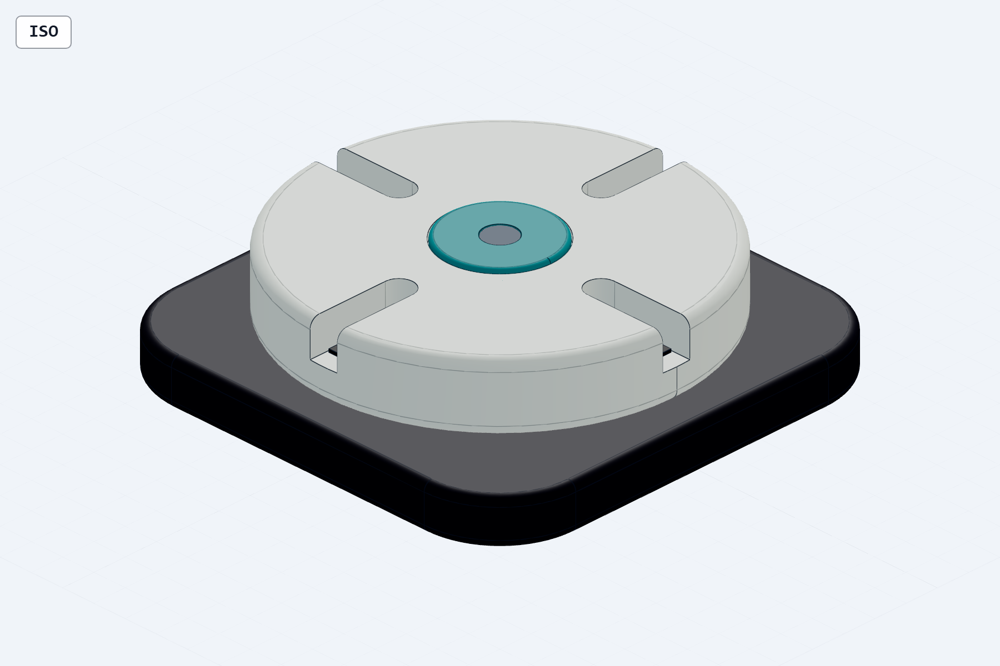
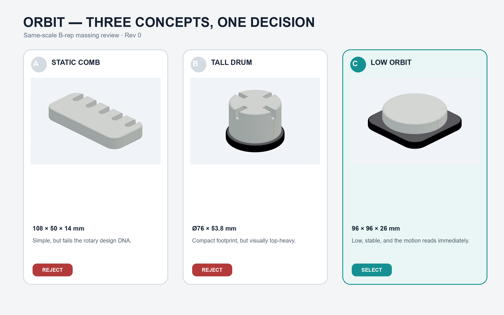
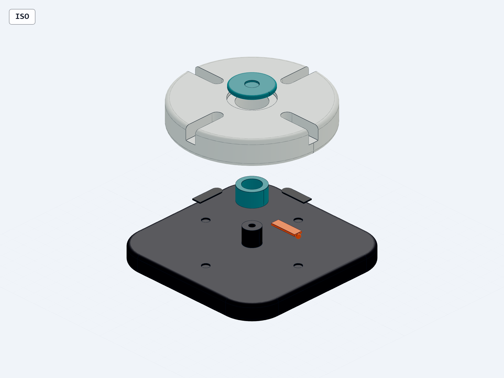
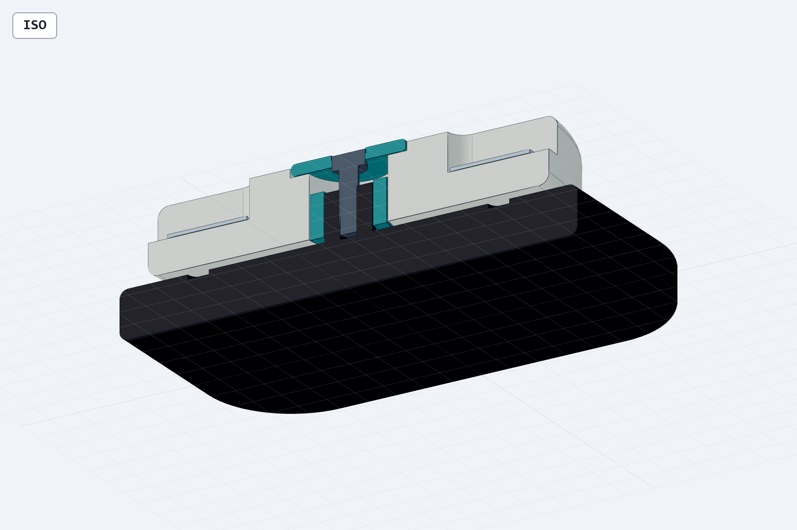

# ORBIT — complete industrial-design-to-engineering case



ORBIT is a four-station rotary desktop cable dock designed entirely inside this repository. The case is intentionally small enough for one person to reproduce, but complex enough to exercise concept selection, proportion, repeated interfaces, a real rotary hierarchy, failure learning, STEP-first CAD, motion states, section/exploded review, DRC, and an evidence-bound engineering handoff.

This is a prototype engineering candidate, not a production release. Cable fit, M4 hardware, detent force/life, FDM compensation, friction, and stability are explicitly open.

## 1. Requirement and design DNA

The product keeps four low-voltage desk cables accessible and lets the user rotate the carrier so the active cable faces the working side.

Hard constraints:

- four open radial cable slots;
- one circular upper carrier rotating around Z;
- four indexed orientations at 0/90/180/270 degrees;
- low desktop posture, below 100 × 100 mm and 30 mm high;
- a visible shadow gap between fixed and moving masses;
- no tower form, unequal slots, pasted plates, or unsupported performance claims.

The complete pre-CAD record is in [brief.json](brief.json). Dimension provenance and every `TBD` are in [dimension-authority.json](dimension-authority.json).

## 2. Three real B-rep concepts



- A, static comb: simplest, but it removes the rotary experience and exceeds the width target.
- B, tall drum: compact footprint and clear motion, but a 53.8 mm height makes it visually top-heavy.
- C, low orbit: preserves rotation while meeting footprint and height gates. Selected under the authority explicitly delegated for this case.

Each concept is a generated STEP model, not a painted thumbnail. See [concept-decision.md](concept-decision.md) and `output/models/concept-*.step`.

## 3. Preserved failure and optimization


The rejected Rev A is geometrically valid. It still fails as a product because its thick rotor reads as a tray stack, its four slots drift, its seam hides the rotation, and exposed centre hardware dominates the form.

Rev C fixes the owning source:

- rotor height reduced from 23 to 14.8 mm;
- visible gap increased from 0.2 to 1.2 mm;
- all four slots use one width/depth/radius source;
- centre retention is recessed and flush;
- four equal TPU floor pads create a real soft cable interface;
- the base, rotor, bushing, pads, detent insert, cap, and hardware envelope remain named parts.

The complete root-cause and recurrence-prevention record is [failure-review.md](failure-review.md).

## 4. Final 3D and motion

| Assembled | Exploded | True B-rep half-section |
| --- | --- | --- |
|  |  |  |

Authoritative source: [cad/orbit_model.py](cad/orbit_model.py). The 0°, 45°, 90°, 180°, and 270° STEP configurations are generated from the same source parameters; 45° is the intermediate collision and visual-continuity state.

Primary and derived files:

- STEP: `output/models/orbit-final.step`
- STL: `output/models/meshes/orbit-final.stl`
- native GLB: `output/models/meshes/orbit-final.glb`
- motion states: `output/models/orbit-state-*.step`
- section model: `output/models/orbit-section-x.step`

The STEP inspection reports 96 × 96 × 26.7 mm, seven leaf component occurrences plus the root, and a positive 1.2 mm axial gap. The source-generated circular rotor stays within the fixed footprint at every angle.

## 5. Engineering handoff

- [BOM](engineering/BOM.csv)
- [Interface control table](engineering/interface-control.csv)
- [Motion-state contract](engineering/motion-states.json)
- [TBD register](engineering/TBD-register.md)
- [Handoff manifest](engineering/handoff-manifest.json)
- [DXF handoff drawing](output/engineering/orbit-engineering-handoff.dxf)
- [PDF handoff sheet](output/engineering/orbit-engineering-handoff.pdf)

The DXF/PDF are explicitly `NTS` prototype handoff documents. They share the same parameter source as the STEP but do not pretend to be a production-complete GB/T drawing.

## 6. Checks that actually ran

| Evidence | Result | Narrow claim |
| --- | --- | --- |
| Pre-CAD brief validator | PASS | Required brief and design-DNA fields exist |
| Dimension-authority validator | PASS | A/B/C/D source classes and `TBD` policy are internally consistent |
| STEP facts/planes/positioning | PASS | Current assembly identity, envelope, occurrence and topology facts read back |
| B-rep geometry DRC | PASS | Named parts are valid; envelope, gap, clearances and shared slot source meet declared rules |
| Motion-state validator | PASS | Required poses exist and remain inside the declared Z-axis limits |
| Same-camera failed/final comparison | PASS | The expected revision change is nonblank and visible |
| DXF audit | PASS | R2018 DXF, explicit mm units, zero audit errors/fixes |
| AutoCAD MCP geometry DRC | PASS | 60 entities; zero dangling endpoints, near misses, duplicates, self-intersections, or interior crossings after two source repairs |
| Revision-bound manifest | PASS | Required files exist and hashes/identity fields agree |

Reports are in [reports](reports). A pass does not prove appearance approval, ergonomics, strength, wear, print quality, safety certification, or physical stability.

## Reproduce

Use Python 3.12 and the case dependencies:

```powershell
python -m venv .venv
.\.venv\Scripts\python -m pip install -r requirements-case.txt
.\run_case.ps1 -Python .\.venv\Scripts\python.exe
```

The runner expects the local CAD and design Skills in the paths shown by its parameters. CAD snapshots require Playwright Chromium; the checked-in review set already records the exact model revision used for this case.
